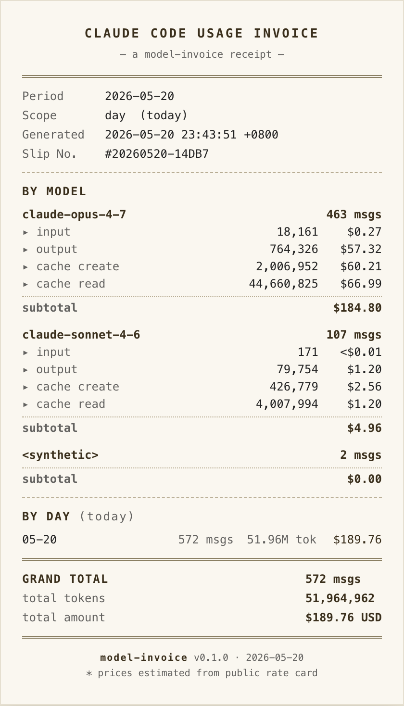

# model-invoice

一键生成 Claude Code 用量小票（HTML / PNG / PDF）。视觉风格借鉴 [`cc-router`](https://github.com/finch-xu/cc-router) 的"暖米色纸张 + monospace"小票外观，但内容只聚焦 Claude Code 原生 usage 数据。

<p align="center">
  
</p>

## 安装与使用

```bash
# 临时跑（无需全局安装）
npx model-invoice

# 全局安装
npm i -g model-invoice
model-invoice
```

数据源：`~/.claude/projects/<encoded-cwd>/<session-id>.jsonl`（Claude Code 本地落盘的会话日志），纯只读，不发任何网络请求。

## 常用命令

```bash
# 今日用量小票 (默认)
model-invoice

# 本周/本月/全部历史
model-invoice --range week
model-invoice --range month
model-invoice --range all

# 切换聚合维度 (BY-X 区块)
model-invoice --scope session
model-invoice --scope project

# 黑白模式
model-invoice --theme mono

# 同时导出 PNG（需要 playwright，详见下方）
model-invoice --png

# 自定义输出位置
model-invoice --output ./my-invoice
```

## CLI 参数

```
数据范围:
  --range <today|week|month|all>   按时间窗口聚合，默认 today
  --session <id>                   只看某个 session
  --project <name>                 只看某个 project

视图聚合:
  --scope <day|session|project>    BY-X 区块的聚合维度，默认 day

视觉:
  --theme <color|mono>             默认 color（暖米色）

输出:
  --output <path>                  自定义输出基名，默认 invoice-YYYY-MM-DD
  --png                            额外生成 PNG
  --pdf                            额外生成 PDF

价格:
  --rates <path.json>              用自定义价目表覆盖内置 PRICES
  --no-cost                        只展示 token，不算金额

其他:
  --claude-dir <path>              覆盖 ~/.claude 位置
```

## PNG / PDF 输出

PNG/PDF 渲染依赖 `playwright`，作为 `optionalDependencies`。如果默认安装时没装上，跑 `--png` 或 `--pdf` 会提示：

```bash
npm i playwright
npx playwright install chromium
```

## 价格说明

- 内置 Anthropic 官方价目表（USD per 1M tokens）
- 价格仅供参考，不构成账单凭据
- 支持 `--rates` 传入自定义价目表 JSON 覆盖

## License

MIT
